# 没有免费午餐原理（No free launch theory）
## 如果不对特征空间有先验假设，则所有算法的平均表现是一样的。

我们认为：特征差距小的样本更有可能是同一类

# 支持向量机（SVM support vector machine）

优化问题（凸优化）

​	最小化（Minimize）

​		限制条件（Subject to） y_i[W^T·x_i + b] >= 1

二次规划问题

​	①目标函数（Object function）是二次项

​	②限制条件是一次项

​	结论：无解或只有一个极值

## 1.线性模型

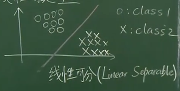

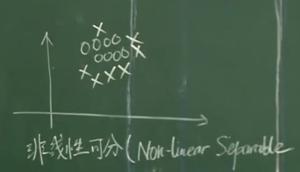

### 算法过程

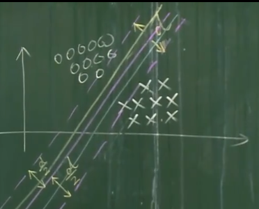

d：间隔（margin）

将平行线接触到的向量称为支持向量（Support Vector）

###　定义

#### 1.训练数据和标签

X：列向量

y：标签（二分类1，-1或 0，1）

(x_1, y_1), (x_2, y_2) ... (x_N, y_N)

#### 2.线性模型

W：列向量

b：常数

找到一个超平面（W，b） W^T·X + b =0

### 3.一个训练集线性可分是指能用超平面划分数据集

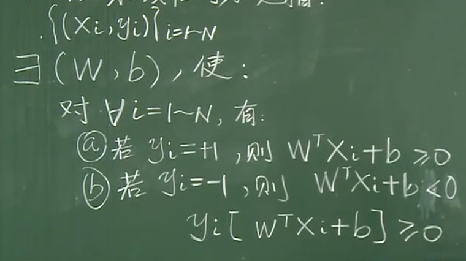

## 事实

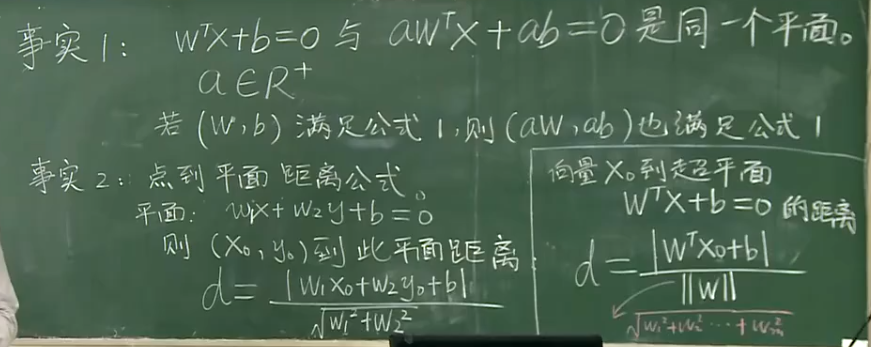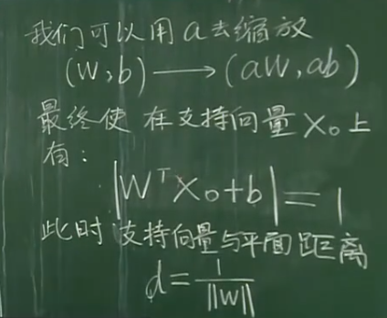

故最小化||W||，即是最大化d

# 2.非线性模型

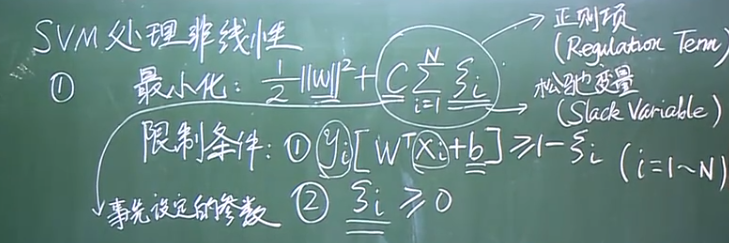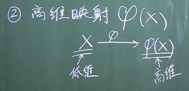

举例：

非线性可分，在高维线性可分

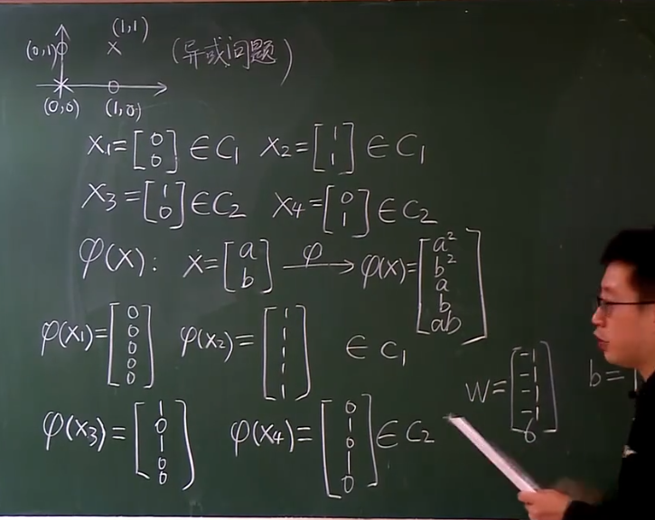

### 核函数

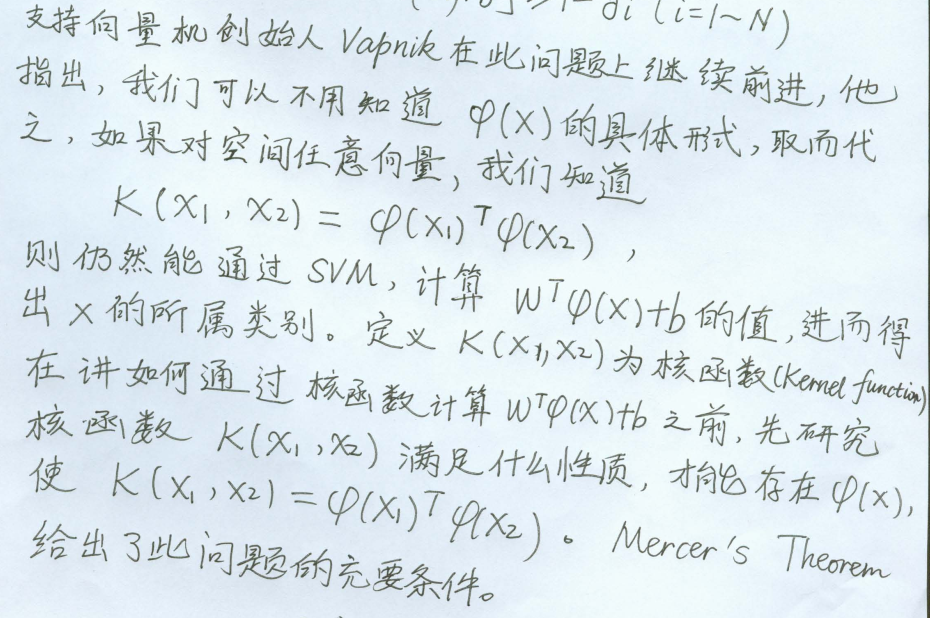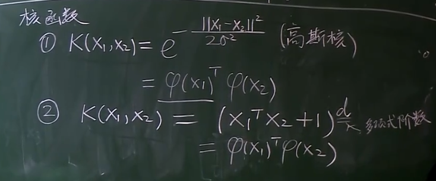

### 核函数可拆分条件

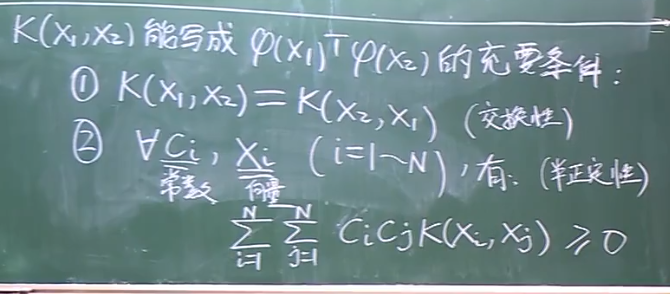